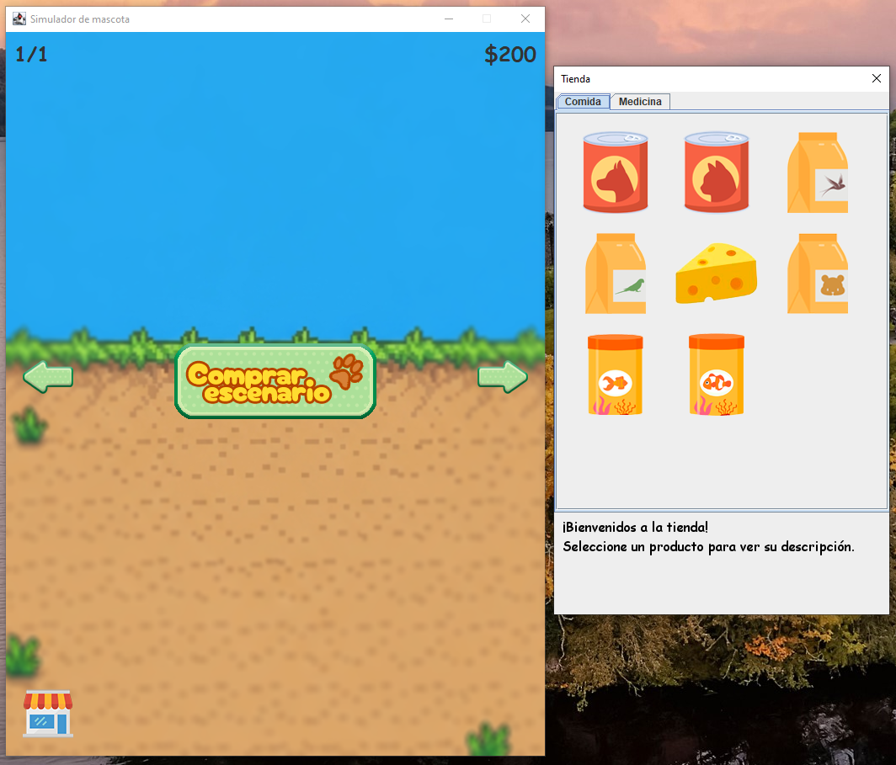
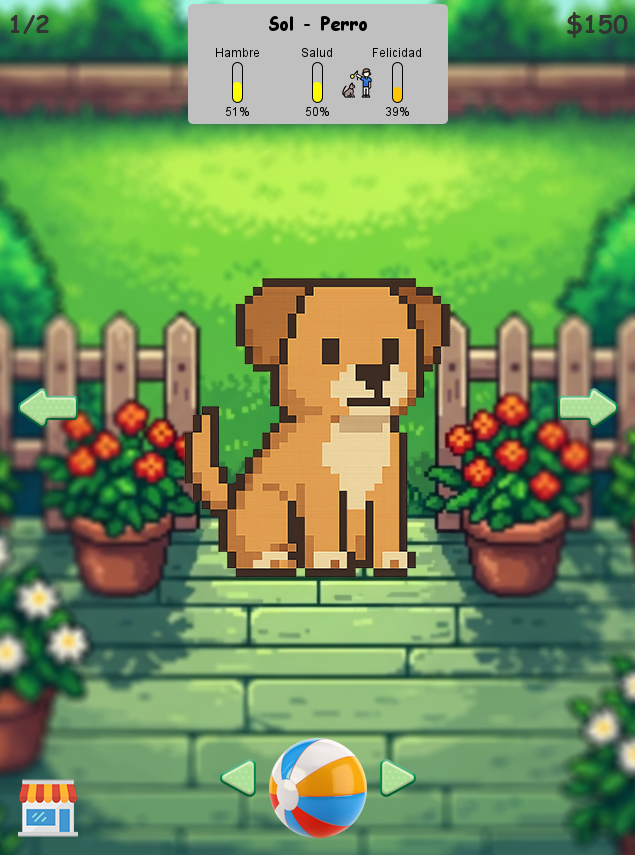
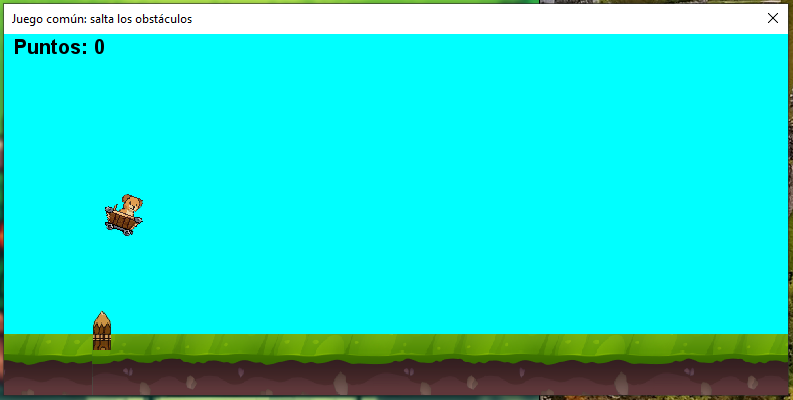

# Proyecto final: Simulador de Tienda de Mascotas Virtual
### Grupo 4:
* José Efraín González Aguayo
* Diego Antonio Matus Salas
## Enunciado:
Se desarrolla un simulador de una tienda de mascotas virtual, donde el jugador puede adoptar mascotas y cuidarlas. Inicialmente, se cuenta con un presupuesto base
para poder comprar un escenario a elección. La progresión del juego se basa en el cuidado de las mascotas, que deben ser alimentadas, medicadas y entretenidas, para luego poder venderlas a un comprador interesado.

El jugador debe comprar escenarios adecuados para poder hospedar a las mascotas, y cada mascota requiere de cierto tipo de alimentación y medicación, que se pueden adquirir en la tienda.

Se pueden tener hasta 10 escenarios diferentes hospedando a mascotas, pero esto le añade dificultad al usuario, ya que debe gestionar el cuidado de todas las mascotas al mismo tiempo.

Si las mascotas están bien cuidadas, es decir, que sus 3 estados estén por sobre el 80% durante un periodo de tiempo, el comprador se interesa en ellas y se despliega un botón de venta.
De esta manera, se puede obtener dinero para comprar más escenarios.

Si ves este boton, significa que el comprador se interesa en la mascota y puedes venderla. Al hacer clic en él, podrás vender la mascota y recibir dinero por ella.

Si ves este icono, significa que la mascota quiere jugar contigo. Debes ir al apartado de "Jugar" y probar el minijuego para que la mascota se divierta.
Esto es un requerimiento para que la mascota pueda ser vendida.

Si ves este icono, significa que la mascota se hirió al jugar, y debes usar la curita para heridas para que se cure (se debe comprar en la tienda).
La mascota debe estar sin heridas para que pueda ser vendida.

Adicionalmente, con los minijuegos se puede ganar dinero, para progresar en caso de quedar sin presupuesto para el cuidado de las mascotas.

### Diagrama de casos de uso UML:

### Prototipo de interfaz:

### Capturas del juego:

## Patrones de diseño utilizados:
* **Singleton**: Se utiliza para asegurar que solo haya una instancia de la tienda de mascotas en el sistema, lo que permite un acceso controlado a los recursos de la tienda,
decidimos que por tener que cargar todas las imagenes de los productos, es mejor que se carguen una sola vez y no cada vez que se acceda a la tienda.
También se utiliza para denotar que las acciones del jugador a las mascotas son globales, es decir, que hay solo un panel de acciones para todas las mascotas y escenarios.
Fue implementado en la clase `TiendaDialog` y `PanelAcciones`.

* **Factory Method**: Se utiliza para crear diferentes tipos de mascotas (perros, gatos, peces) de manera que en su uso no
haya que preocuparse por los detalles de su creación. Por ejemplo, que cada mascota deba tener un escenario adecuado disponible para existir.
Esto permite una mayor flexibilidad y escalabilidad en la adición de nuevas mascotas. Fue implementado en la clase `MascotaFactory` y sus subclases:
`PerroFactory`, `GatoFactory`, `PezDoradoFactory`, `PezPayasoFactory`, `HamsterFactory`, `RatonFactory`, `GolondrinaFactory` y `LoroFactory`.

  
* **Command**: Se utiliza para encapsular el comportamiento de los botones del apartado visual, permitiendo que la acción de cada botón sea tratada como un objeto independiente.
Esto se aplica para separar responsabilidades, facilitar la extensión y legibilidad del sistema. Por ejemplo, a futuro pueden varios botones tener el mismo comportamiento reutilizando el mismo comando.
Fue implementado en la clase `Command` y sus subclases: `AdoptarMascotaCommand`, `ComprarProductoCommand`, `VenderMascotaCommand`, `InicializarEscenarioCommand`, `SeleccionarMascotaCommand` y `SeleccionarEscenarioCommand`.

## Decisiones importantes tomadas:
Nuestro enfoque principal para la creación de este simulador fue lograr se sintiera como un juego interactivo, poniendo especial énfasis en el apartado visual
y la interacción del usuario. Por eso, decidimos implementar elementos que mejoran la experiencia, como botones con respuesta visual y sonora al ser presionados,
y que las mascotas tengan un nombre aleatorio para dar la sensación de que cada mascota es única. 

Además, buscamos que la interacción con las mascotas fuera más dinamica:
por ejemplo, se puede hacer clic sobre ellas para que reaccionen, y las acciones como alimentarlas o medicarlas requieren que el usuario arrastre
la comida o medicina hacia la mascota. Si no lo hace, esta no comerá ni se medicará, lo que refuerza el carácter interactivo del juego. 

También, se implementa la capacidad de jugar con las mascotas mediante una pelota que rebota en la pantalla, o jugar mediante un juego específico para cada tipo de mascota,
que es un requerimiento para que el usuario pueda venderla más adelante.

Para dar la sensación de que hay un comprador interesado en las mascotas, se implementa un hilo que revisa periódicamente si una mascota está bien
cuidada, y luego de cierto tiempo aleatorio, el comprador se interesa en ella y se despliega el botón de venta.

## Problemas identificados:
El principal problema que se encontró durante el desarrollo del proyecto fue querer implementar demasiadas funcionalidades desde el primer momento,
y no tener claro cómo se relacionan entre sí. Esto llevó a cierto desorden en la estructura del código, lo que dificultó la separación de
la parte lógica de la parte visual. Debimos tener una planificación más gradual, y tener más en cuenta el tiempo que teníamos para el proyecto, porque
nos quedamos con ganas de implementar más funcionalidades, pero no nos dio el tiempo. 

Una mejor planificación y organización del código desde el principio
hubiera permitido una mejor separación de responsabilidades y una mayor facilidad para agregar nuevas funcionalidades en el futuro. Actualmente, la lógica del simulador
está muy acoplada a la parte visual, lo que dificulta la reutilización del código en otros contextos. Esto se notó al momento de querer hacer pruebas unitarias,
en donde se dificulta hacer estas pruebas debido a la dependencia de la parte visual.